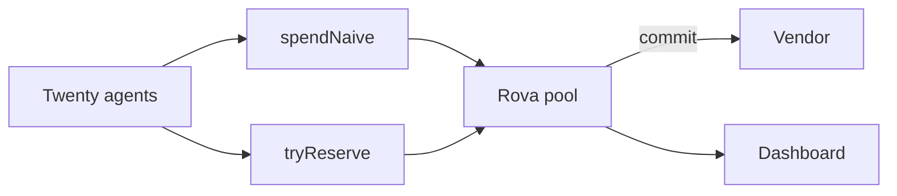

# Rova

**Twenty agents. One pool. A cap that holds.**

Rova is a shared payment pool. Every agent spends from the same balance, and the pool pays the vendor directly. A payment is allowed only after the contract reserves the funds in the same transaction. The reservation expires, so a crashed agent cannot lock the cap forever.

The payment token is rUSD, an 18-decimal ERC-20 with a public mint. The demo funds the pool with 30 and sets the cap at 10. That slack is the point: the naive path can move real tokens past the cap, and the reserve path stops at 10.

* **Live dashboard:** https://rova-production-f873.up.railway.app
* **The measured run:** the same page. Naive spent 20. Reserve mode accepted 10, refused 10, and finished at 10.
* **Chain:** Monad testnet, chain id 10143. RPC [`https://testnet-rpc.monad.xyz`](https://testnet-rpc.monad.xyz). Explorer [`https://testnet.monadscan.com`](https://testnet.monadscan.com)

---

## Contents

* [The problem](#the-problem)
* [What Rova does](#what-rova-does)
* [How it works](#how-it-works)
* [Architecture](#architecture)
* [Guarantees](#guarantees)
* [The measured run](#the-measured-run)
* [The screen](#the-screen)
* [Tech stack](#tech-stack)
* [Running it yourself](#running-it-yourself)
* [Testing](#testing)
* [Project layout](#project-layout)
* [Known limitations](#known-limitations)
* [License](#license)

---

## The problem

A team of agents sharing one budget will overspend if each agent reads the balance and then pays. The balance is still there when the next agent looks. Twenty payments of 1 go through. The cap was 10.

Checking and spending in two steps is the bug. The cap has to move in the same transaction as the check.

## What Rova does

Rova keeps one pool and one hard cap. Agents hold none of the funds. The pool pays the vendor.

The product rests on one boundary:

> **The cap changes only inside the transaction that locks the funds.**

`spendNaive` is the broken path, kept in the contract so the race can be watched. It pays whatever tokens are not already reserved. `reserve` and `tryReserve` refuse anything that would push `spent + reserved` past the cap.

Monad is the target network because the fix is many small transactions: one reserve and one commit per agent. Testnet confirmation is cheap and fast enough to run that burst in one sitting. This repository also runs the same bytecode on Anvil, which is where the measured run below was produced.

## How it works



1. **Deploy the pool.** `MockToken` is rUSD. `Rova` is constructed with that token and a cap of 10. Anyone can mint rUSD. It has no value.
2. **Fund 30.** `fund` pulls tokens in with `transferFrom`. The token balance is the float. The cap is the policy. They are different numbers on purpose.
3. **Run the naive path.** Twenty agents each call `spendNaive` for 1. Each call sees unreserved tokens and pays. Spent becomes 20. The overshoot is 10. The vendor at `0x…00fe` holds 20.
4. **Reset.** The owner pulls the leftover tokens and the counters return to zero. The log stays, so the overshoot is still on the dashboard.
5. **Reserve first.** The pool is funded with 30 again. Twenty agents call `tryReserve` for 1, with an expiry one hour out. Ten reservations lock. Ten emit `Refused` and return 0.
6. **Commit.** Each accepted reservation pays its full 1 to the vendor at `0x…00ff`. Spent is 10. The overshoot is 0.
7. **Watch it.** The dashboard keeps both results. Available, reserved, and spent come from the chain when one is attached. The recorded run stays readable when it is not.

A commit can pay less than it reserved. The vendor receives `actualCost`. The difference stays in the pool and the cap frees that amount. `release` returns a whole reservation. After `expiry`, anyone can release it. Views treat an expired reservation as free before that transaction lands, so a later reserve can take the cap.

## Architecture

One Solidity contract holds the pool. A Node script runs both modes. A single page reads the log.

| Piece | What it does | Where |
| --- | --- | --- |
| rUSD | Public-mint ERC-20, 18 decimals, symbol `rUSD` | `src/MockToken.sol` |
| Pool | Cap, reserve, commit, release, naive spend, reset | `src/Rova.sol` |
| Demo | Twenty agents, naive then reserved, prints every hash | `scripts/demo.mjs` |
| Page | Scoreboard, bar, reservations and refusals | `web/` |
| Server | Serves the page and proxies `/rpc` at the pool | `scripts/serve.mjs` |

The reserver is `msg.sender` of `reserve`. That address, or the owner, can `commit` and `release`. After expiry, `release` is open to anyone. The demo uses one operator key and passes each agent address as an argument. The agent never custodies the token.

| Call | Effect |
| --- | --- |
| `fund(amount)` | Pull rUSD into the pool |
| `reserve(agent, amount, expiry)` | Lock `amount` or revert `InsufficientAvailable` |
| `tryReserve(agent, amount, expiry)` | Same check. On a shortage, emit `Refused` and return 0 |
| `commit(id, actualCost, vendor)` | Pay the vendor, keep the difference in the pool, mark the reservation settled |
| `release(id)` | Return the reservation to the cap |
| `spendNaive(agent, amount, vendor)` | Pay unreserved tokens and ignore the cap |
| `reset(to)` | Return leftover tokens and zero the counters. Live reservations block it |
| `available` / `reserved` / `spent` / `overshoot` | The cap, from the outside |

`available()` is `cap - spent - liveReserved`. `poolBalance()` is the token balance. Expired reservations are left out of the live total.

## Guarantees

Each row is enforced in `src/Rova.sol` and covered in `test/Rova.t.sol`.

| Guarantee | How | Test |
| --- | --- | --- |
| Twenty reservations of 1 against a cap of 10 stop at 10 | The lock reads `cap - spent - reserved` and updates it in the same call | `test_manyReservesNeverExceedCap` |
| An amount past the remaining cap reverts | `reserve` reverts `InsufficientAvailable` and emits nothing | `test_overReserveReverts` |
| A refused reservation is visible | `tryReserve` emits `Refused` and returns 0 | `test_tryReserveEmitsRefusal` |
| A cheaper commit refunds the pool | Pay 2 from a reservation of 5. The vendor receives 2. 3 stays in the pool. Available becomes 8 | `test_commitRefundsDifferenceToPool` |
| A commit cannot exceed its reservation | `CostExceedsReservation` | `test_commitAboveReservationReverts` |
| A stranger cannot move a live reservation | Commit and release require the reserver or the owner | `test_strangerCannotCommitOrRelease` |
| The owner can settle someone else's reservation | The owner is set at construction | `test_ownerCanCommit` |
| An expired reservation can be released by anyone | `release` after `expiry` emits `Released` and restores the cap | `test_expiryReleasesToAnyone` |
| Expiry frees the cap for a new reserve | Views ignore the expired lock. The next reserve reclaims it and takes the cap | `test_expiryFreesCapForNewReserve` |
| A commit after expiry reverts | The reservation stays active in storage until something reclaims it | `test_commitAfterExpiryReverts` |
| The naive path spends 20 against a cap of 10 | `spendNaive` pays while unreserved tokens remain | `test_naiveSpendOvershootsCap` |
| Reserved tokens stay put during a naive spend | Free tokens are `balance - reservedActive` | `test_naiveCannotTakeReservedTokens` |
| Reset clears the counters | Cap is unchanged. Tokens already paid to a vendor stay there | `test_resetClearsAccounting` |
| Reset waits until the cap is free | `ReservedOutstanding` while `reservedActive` is non-zero | `test_resetRequiresNoActiveReserve` |

## The measured run

Local Anvil, 10 October 2026. Cap 10. Float 30. Twenty agents, 1 each. The dashboard at https://rova-production-f873.up.railway.app serves this run from `web/recording.json`. Every hash is in that file and on the page.

| Step | Result |
| --- | --- |
| Naive, 20 payments of 1 | spent 20.00, overshoot 10.00, vendor `0x00000000000000000000000000000000000000fe` holds 20.00 |
| Reset | counters at zero, the log kept |
| `tryReserve`, 20 times | 10 accepted, 10 `Refused` |
| Commit the 10 | spent 10.00, reserved 0, available 0, overshoot 0.00, vendor `0x00000000000000000000000000000000000000ff` holds 10.00 |
| Pool after the commits | 20.00 rUSD still in the contract, under a spent cap of 10 |

The contracts on that Anvil node:

| Contract | Address |
| --- | --- |
| rUSD | `0x5FbDB2315678afecb367f032d93F642f64180aa3` |
| Rova | `0xe7f1725E7734CE288F8367e1Bb143E90bb3F0512` |

Those addresses belong to that Anvil deployment. `pnpm demo` prints a fresh set of hashes when it runs again.

## The screen

One page.

| Region | What it shows |
| --- | --- |
| Check, then pay | Naive spent, the cap, the overshoot, and a bar that runs past the cap |
| Reserve, then pay | Accepted, refused, and a bar that stops on the cap |
| Chain now | `available`, `reserved`, `spent`, `overshoot`, pool balance, both vendor balances |
| Reservations and refusals | `FUND`, `NAIVE`, `RESERVE`, `REFUSED`, `COMMIT`, `RESET`, each with its transaction hash |

With a chain attached, the bar and the list follow the logs. The hosted page has the recording and no chain, and it says so.

## Tech stack

| Layer | Choice |
| --- | --- |
| Contract | Solidity 0.8.28, Foundry, optimizer 200, Cancun |
| Token | rUSD, `src/MockToken.sol` |
| Chain | Monad testnet, chain id 10143. The measured run is Anvil, chain id 31337 |
| Demo | Node 20, viem, `scripts/demo.mjs` |
| Page | One HTML file, no build, no CDN |
| Host | Railway, `https://rova-production-f873.up.railway.app` |
| Tests | `forge test`, 16 tests in `test/Rova.t.sol` |

## Running it yourself

Foundry and Node 20. From this directory:

```bash
forge install foundry-rs/forge-std --no-git
pnpm install
pnpm test
```

`forge install` on Foundry 1.7.1 takes `--no-git`. The library lands in `lib/`, which is gitignored.

Start a chain in one terminal:

```bash
anvil --host 127.0.0.1 --port 8545
```

In another:

```bash
pnpm demo
pnpm serve
```

Open http://127.0.0.1:4173

Leave `PRIVATE_KEY` unset on a local node. The demo uses Anvil account 0 and does not read `.env`. For Monad testnet:

```bash
export RPC_URL=https://testnet-rpc.monad.xyz
export PRIVATE_KEY=...
pnpm demo
```

The hostname `rpc.testnet.monad.xyz` does not resolve. Use `testnet-rpc.monad.xyz`. The script estimates gas and exits before it sends when the balance is short. The faucet is https://faucet.monad.xyz.

| Command | What it does |
| --- | --- |
| `pnpm test` | `forge test` |
| `pnpm demo` | Both modes. Writes `web/config.json` and `web/snapshot.json` |
| `pnpm serve` | The page on port 4173, or `PORT` |
| `pnpm start` | Same server, for the host |

The browser calls same-origin `/rpc`. The server forwards that to the `rpc` field in `web/config.json`.

## Testing

**16 tests, one file,** `test/Rova.t.sol`. Run with `pnpm test`.

The suite is the cap, the refund, the expiry, and the naive overshoot. Names are in the [guarantees](#guarantees) table. `test_badExpiryReverts` rejects a reservation whose expiry is already due. `test_fundIncreasesDeposited` checks that a fund of 30 leaves `available()` at the cap of 10.

## Project layout

| Path | What lives there |
| --- | --- |
| `src/Rova.sol` | The pool |
| `src/MockToken.sol` | rUSD |
| `test/Rova.t.sol` | The Foundry suite |
| `scripts/demo.mjs` | The twenty-agent run |
| `scripts/serve.mjs` | The page and the RPC proxy |
| `web/` | `index.html`, `app.js`, `styles.css`, the recorded run |
| `web/recording.json` | The Anvil run the hosted page shows |
| `foundry.toml` | Solidity 0.8.28, Cancun, Monad RPC alias |
| `Dockerfile` | The hosted page |

`web/config.json` and `web/snapshot.json` are written by the demo and gitignored.

## Known limitations

* **rUSD is a demo token.** Anyone can mint it. It has no value and no issuer. The float of 30 exists so the naive path has tokens past the cap of 10.
* **The hosted page is the recording.** https://rova-production-f873.up.railway.app reads `web/recording.json`. It has no chain attached, and the page says so.
* **The measured contracts are on Anvil.** The addresses above come from that local node. A Monad testnet create of the two contracts was priced at about 0.155 MON at 102 gwei on 10 October 2026, which was more MON than the wallets in use held. No testnet transaction was sent.
* **One key sends every agent transaction.** The agent is an argument. The reserver is the sender. That matches a single operator running the demo.
* **Expiry is reclaimed by walking the reservations.** Views skip expired rows. The next state-changing call releases them. The demo has a few dozen rows.

## License

MIT. See [LICENSE](LICENSE).

Grok wrote this repository from a short brief. The Foundry tests and the Anvil demo were run on this machine. This is a demonstration, not an audit.
